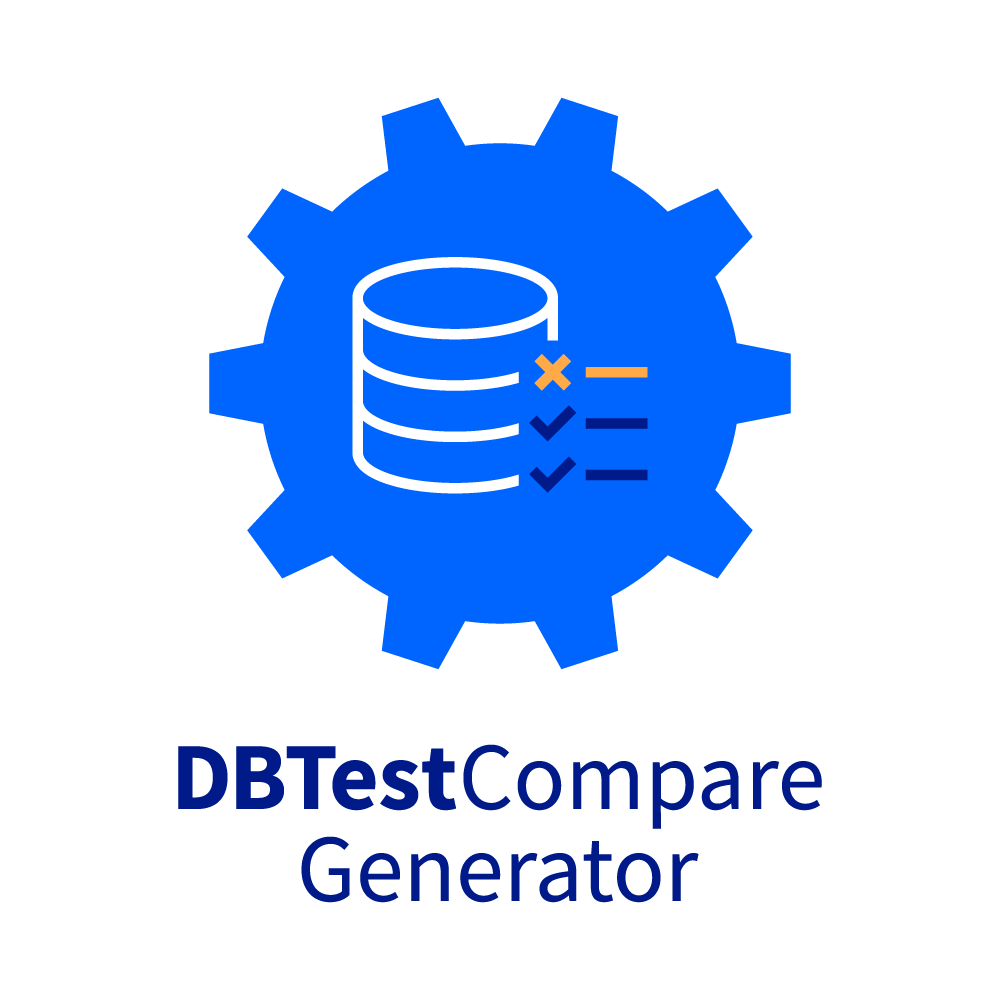

# DBTestCompareGenerator

## Tool for generating database tests that can be run with **[DBTestCompare](https://github.com/Accenture/DBTestCompare)**
### And extracting and unpacking DACPAC **Microsoft SQL Server DAC Package File** using [DacFx package](https://github.com/microsoft/DacFx).


Supported databases: **SQL Server**

AI generated documentation [DeepWiki](https://deepwiki.com/Accenture/DBTestCompareGenerator)

It reads the definition of tables to be tested from system tables of your database and generates tests which can be executed by [DBTestCompare](https://github.com/Accenture/DBTestCompare/wiki/Getting-started) application. 

```sql
SELECT TABLE_CATALOG, TABLE_SCHEMA, TABLE_NAME,COLUMN_NAME, IS_NULLABLE, DATA_TYPE 
FROM INFORMATION_SCHEMA.COLUMNS  
order by 1,2,3;
```


### 1. To start using **DBTestCompareGenerator** download the latest [release](https://github.com/Accenture/DBTestCompareGenerator/releases) and set connection string to your database in *appsettings.json* file.

```json
{
  "appSettings": {
    "ReadExcelFile": "false",
    "GenerateCountSmokeTests": "true",
    "GenerateCompareFetchTests": "true",
    "GenerateCompareMinusTests": "true",
    "ColumnTypesToGroupBy": "nvarchar,nchar,datetime,date,bit",
    "DBNameLiveMinusTests": "AdventureWorks2008R2",
    "DBNameBranchMinusTests": "AdventureWorks2008R2Branch",
    "ConnectionStrings": {
      "DB": "User ID=SA;Password=yourStrong22Password;Initial Catalog=AdventureWorks2008R2;Data Source=localhost;"
    }
  }
}
```
and just run *DBTestCompareGenerator.exe* application on Windows or *DBTestCompareGenerator* on Linux.

Tests should be created in folder *".\test-definitions\"*

### 2. To generate tests for **all tables** in database set *ReadExcelFile* to *false* in *appsettings.json*.

DBTestCompareGenerator by default is creating three types of test:
-	Smoke tests – counting the number of rows in each of the tables. The number of rows is obtaining from the database system tables. 
Query:
```sql
SELECT 
 sum(cast(SysP.row_count as bigint)) 
 FROM sys.dm_db_partition_stats as SysP 
 inner join sys.indexes as SysI 
 on SysP.object_id = SysI.object_id 
 and SysP.index_id = SysI.index_id 
 inner join sys.tables as SysT 
 on SysP.object_id = SysT.object_id 
 inner join sys.schemas as SysS 
 on SysT.schema_id = SysS.schema_id 
 WHERE 
 SysI.[type] in (0, 1)  and SysS.name = 'Person' and SysT.name = 'Address'; 
 ```
 Test Definition:
 ```xml
 <cmpSqlResultsTest>
    <compare mode="FETCH" fetchSize="100000" chunk="10" diffTableSize="5" fileOutputOn="false" delta="0.00001">
        <sql datasourceName="SQL_SERVER_Live" filename="ExpectedTable.sql" />
        <sql datasourceName="SQL_SERVER_Branch" filename="ActualTable.sql" />
    </compare>
</cmpSqlResultsTest>
 ``` 
-	[Fetch](https://github.com/Accenture/DBTestCompare/wiki/Fetch) tests – comparing two queries in DBTestCompare tool memory (between any two databases)
```sql
SELECT 
"BusinessEntityID", 
"rowguid", 
"ModifiedDate" 
FROM 
 Person.BusinessEntity 
order by BusinessEntityID; 
 ```
 Test Definition:
 ```xml
 <cmpSqlResultsTest>
    <compare mode="FETCH" fetchSize="100000" chunk="10" diffTableSize="5" fileOutputOn="false" delta="0.00001">
        <sql datasourceName="SQL_SERVER_Live" filename="ExpectedTable.sql" />
        <sql datasourceName="SQL_SERVER_Branch" filename="ActualTable.sql" />
    </compare>
</cmpSqlResultsTest>
 ``` 
-	[Minus](https://github.com/Accenture/DBTestCompare/wiki/Minus) test - compare two queries by db engine (on one server) using MINUS/EXCEPT Sql operator
```sql
SELECT 
"AddressTypeID" , 
"Name" , 
"rowguid" , 
"ModifiedDate" 
FROM 
 AdventureWorks2008R2.Person.AddressType 
 ```
 ```sql
SELECT 
"AddressTypeID" , 
"Name" , 
"rowguid" , 
"ModifiedDate" 
FROM 
 AdventureWorks2008R2Branch.Person.AddressType 
 ```
 Test Definition:
 ```xml
<cmpSqlResultsTest>
    <compare mode="MINUS" defaultDatasourceName="SQL_SERVER_Live" diffTableSize="50" fileOutputOn="false" minusQueryIndicatorOn="true">
        <sql minusQueryIndicatorOccurence="1" minusQueryIndicatorText="Expected" filename="ExpectedTable.sql" />
        <sql minusQueryIndicatorOccurence="1" minusQueryIndicatorText="Actual" filename="ActualTable.sql" />
    </compare>
</cmpSqlResultsTest>
 ``` 
 
You should choose which tests you want to execute Minus or Fetch and disable one type in *appsettings.json*  as both are testing the same but in different way.
 
### 3. If you want to choose for which tables generate tests, set *ReadExcelFile* to *true* in *appsettings.json* and fill in a list of tables in file */Templates/Table_Config.xlsx*.


In the excel file for e.g huge tables which comparing can be time-consuming, you can choose in AggregateByClause column of Excel file columns to be aggregated as SUM (for columns in the table contains numeric values). 

```sql
SELECT 
 sum(cast(ProductID as bigint)), sum(cast(SafetyStockLevel as bigint)), sum(cast(ReorderPoint as bigint)), sum(cast(StandardCost as money)), sum(cast(ListPrice as money)), sum(cast(Weight as decimal)), sum(cast(DaysToManufacture as bigint)), sum(cast(ProductSubcategoryID as bigint)), sum(cast(ProductModelID as bigint))
FROM 
 Production.Product
```
Rest of the column types listed in *appsettings.json* 
```json
"ColumnTypesToGroupBy": "nvarchar,nchar,datetime,date,bit"
```
will be grouped and counted.
```sql
SELECT 
 Color, count_big(*) AS CountNo 
FROM  Production.Product
group by Color
order by Color;
```

### 4. If you want to change any setting in *appsettings.json* in your CI tool you can use script [set-appsettings.ps1](https://github.com/Accenture/DBTestCompareGenerator/blob/master/DBTestCompareGenerator/set-appsettings.ps1).

 ```powershell
 .\set-appsettings.ps1 ".\" "appsettings.json" "appSettings" "ReadExcelFile" "true" $true
 ```

### 5. Before execution of your generated tests, you have to replace tokens in the connection definition file [cmpSqlResults-config.xml](https://github.com/Accenture/DBTestCompareGenerator/blob/master/DBTestCompareGenerator/Templates/cmpSqlResults-config.xml)

You can use for that attached PowerShell script [set-tokens-for-tests.ps1](https://github.com/Accenture/DBTestCompareGenerator/blob/master/DBTestCompareGenerator/set-tokens-for-tests.ps1)

 ```powershell
.\set-tokens-for-tests.ps1 -OutDir ".\test-definitions\" -FileType "cmpSqlResults-config.xml" -token "\$\{SQL_SERVER\}|\$\{SQL_SERVERDBNAME\}|\$\{SQL_SERVER_USERNAME\}|\$\{SQL_SERVER_PASSWORD\}" -Value "localhost|AdventureWorks2008R2|SA|yourStrong22Password"
 ```
 
### 6.To execute tests download the latest version of [DBTestCompare](https://github.com/Accenture/DBTestCompare) from [here](https://github.com/Accenture/DBTestCompare/releases) and [SQL Server JDBC Drivers](https://github.com/Accenture/DBTestCompare/wiki/Deploying-licensed-jdbc-drivers-(not-open-source)) 

### And run program (Java 8 must be installed first (JDK or JRE)):
If you set JAVA_HOME variable:
```
java -jar DBTestCompare-1.0-SNAPSHOT-jar-with-dependencies.jar
```
More details can be found [here](https://github.com/Accenture/DBTestCompare/wiki/Getting-started)

### 7. To extract and unpack DACPAC **Microsoft SQL Server DAC Package File** change following settings in *appsettings.json* 

```json
    "ExtractAllTableData": "false",
    "ExtractApplicationScopedObjectsOnly": "false",
    "VerifyExtraction": "false",
    "IgnoreExtendedProperties": "false",
    "IgnorePermissions": "false",
    "SaveAsBaseline": "false",
    "UnpackDacpac": "true",
    "DacpacFolder": "c:\\ProjectPath\\Dacpac",
    "Folder": "c:\\ProjectPath\\Definitions",
```
